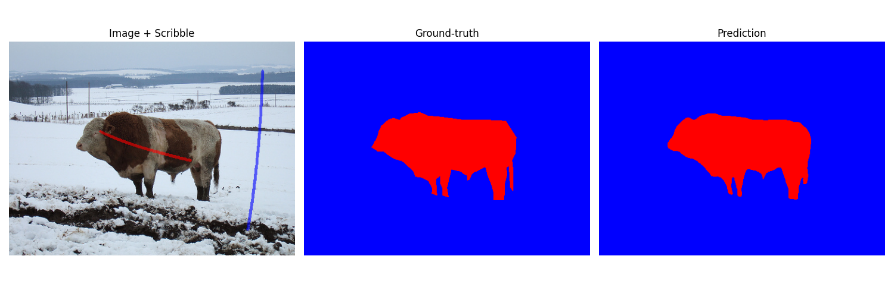

# ScribbleSeg: Binary Image Segmentation

This project implements a complete scribble-supervised binary image segmentation pipeline built from scratch using PyTorch.

---

## Project Structure
```text
ScribbleSeg/
├── data/
│   ├── ground_truths/    # Ground-truth masks
│   ├── images/           # Training images
│   ├── predictions/      # Predicted segmentation masks
│   ├── preprocessed/     # Cached tensors after preprocessing
│   └── scribbles/        # Scribble supervision masks
│
├── data_no_gtrs/         # Test data (no ground-truths)
│   ├── images/
│   └── scribbles/
│
├── src/
│   ├── dataset.py        # Dataset loading and storage helpers
│   ├── evaluation.py     # IoU metrics
│   ├── loss.py           # Loss functions
│   ├── model.py          # UNet-ResNet34 architecture
│   ├── plot.py           # Visualization utilities
│   ├── preprocessing.py  # Superpixel, spectral propagation and weight map builder
│   └── segmentation.py   # Prediction, CRF post-processing and augmentation
│
├── best_model.pth        # Best checkpoint (saved by validation mIoU)
├── ex_res.png
├── main.py               # Training + validation + visualization pipeline
└── README.md
```

---

## Requirements

Install all dependencies with:
```bash
pip install torch torchvision segmentation-models-pytorch scikit-learn scikit-image scipy pillow numpy tqdm pydensecrf matplotlib
```

---

## Running the Pipeline

Train and evaluate the model:
```bash
python main.py
```

This script will:

1. Load the preprocessed dataset from `data/preprocessed/preprocessed.pt`.
2. Train a UNet-ResNet34 segmentation network using hybrid loss.
3. Apply CRF post-processing to refine masks.
4. Save the best model to `best_model.pth`.
5. Display one randomly chosen visual comparison.
6. Store segmentation outputs in `data/predictions/`.

> ### Note:
> - Both `data/preprocessed/preprocessed.pt` and `best_model.pth` are large generated artifacts and not tracked in Git.
> - You must create the former manually before running the main script:
>   ```bash
>   python src/preprocessing.py
>   ```
> - `best_model.pth` will be created automatically when you train.

---

## Scribble Supervision Format

- Scribble masks use:
  - 0: Background
  - 1: Foreground
  - 255: Unlabeled

Predictions and ground truths are binary masks using 0 and 1.

---

## Example Result

Below is an example result from the trained model:

<p align = "center">
  
</p>
